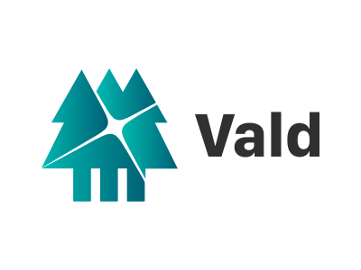

<div align="center">
<a href="https://vald.vdaas.org/">
    
</a>
</div>

[](https://opensource.org/licenses/Apache-2.0)
[](https://github.com/vdaas/vald/releases/latest)
[](https://pkg.go.dev/github.com/vdaas/vald)
[](https://www.codacy.com/app/i.can.feel.gravity/vald?utm_source=github.com&utm_medium=referral&utm_content=vdaas/vald&utm_campaign=Badge_Grade)
[](https://goreportcard.com/report/github.com/vdaas/vald)
[](https://depshield.github.io)
[](https://app.fossa.com/projects/custom%2B21465%2Fvald?ref=badge_small)
[](https://deepsource.io/gh/vdaas/vald/?ref=repository-badge)
[](https://deepsource.io/gh/vdaas/vald/?ref=repository-badge)
[](https://cla-assistant.io/vdaas/vald)
[](https://artifacthub.io/packages/chart/vald/vald)
[](https://join.slack.com/t/vald-community/shared_invite/zt-db2ky9o4-R_9p2sVp8xRwztVa8gfnPA)
[](https://twitter.com/vdaas_vald)

<!--[](https://codecov.io/gh/vdaas/vald) -->

## What is Vald?

Vald is a highly scalable distributed fast approximate nearest neighbor (ANN) dense vector search engine.

Vald is designed and implemented based on Cloud-Native architecture.

Vald has automatic vector indexing and index backup, and horizontal scaling which made for searching from billions of feature vector data.

Vald is easy to use, feature-rich and highly customizable as you needed.

It uses the fastest ANN Algorithm [NGT](https://github.com/yahoojapan/NGT) to search neighbors.

(If you are interested in ANN benchmarks, please refer to [ann-benchmarks.com](https://ann-benchmarks.com/).)

For more information, please refer to [Official Web Site](https://vald.vdaas.org).

<div align="center">
  
</div>

Vald can handle any object data, image, audio processing, video, text, binary, or etc., if converting to the vector, and be used for:

- Recognition
- Recommendation
- Detecting
- Grammar checker
- Real-time translator
- also you want to do!

## Requirements

- Kubernetes 1.19~
- AVX2 instructions (required by Vald Agent NGT)

## Get Started

Go to [Get Started](https://vald.vdaas.org/docs/tutorial/get-started) page to try out Vald !

## Installation

### Using Helm

```shell
helm repo add vald https://vald.vdaas.org/charts
helm install vald-cluster vald/vald
```

If you use the default values.yaml, the `nightly` images will be installed.

### Using Helm-operator

Please refer to [vald-helm-operator](https://github.com/vdaas/vald/blob/main/charts/vald-helm-operator).

## Components

<table>
  <tr>
    <th>Component</th>
    <th>Docker image</th>
    <th>latest image</th>
    <th>nightly image</th>
  </tr>
  <tr>
    <td>Agent NGT</td>
    <td>
      <a href="https://hub.docker.com/r/vdaas/vald-agent-ngt">
        
      </a><br/>
      <a href="https://github.com/orgs/vdaas/packages/container/package/vald/vald-agent-ngt">
        
      </a>
    </td>
    <td>
      <a href="https://hub.docker.com/r/vdaas/vald-agent-ngt/tags?page=1&name=latest">
        
      </a>
    </td>
    <td>
      <a href="https://hub.docker.com/r/vdaas/vald-agent-ngt/tags?page=1&name=nightly">
        
      </a>
    </td>
  </tr>
  <tr>
    <td>Agent Sidecar</td>
    <td>
      <a href="https://hub.docker.com/r/vdaas/vald-agent-sidecar">
        
      </a><br/>
      <a href="https://github.com/orgs/vdaas/packages/container/package/vald/vald-agent-sidecar">
        
      </a>
    </td>
    <td>
      <a href="https://hub.docker.com/r/vdaas/vald-agent-sidecar/tags?page=1&name=latest">
        
      </a>
    </td>
    <td>
      <a href="https://hub.docker.com/r/vdaas/vald-agent-sidecar/tags?page=1&name=nightly">
        
      </a>
    </td>
  </tr>
  <tr>
    <td>Discoverer</td>
    <td>
      <a href="https://hub.docker.com/r/vdaas/vald-discoverer-k8s">
        
      </a><br/>
      <a href="https://github.com/orgs/vdaas/packages/container/package/vald/vald-discoverer-k8s">
        
      </a>
    </td>
    <td>
      <a href="https://hub.docker.com/r/vdaas/vald-discoverer-k8s/tags?page=1&name=latest">
        
      </a>
    </td>
    <td>
      <a href="https://hub.docker.com/r/vdaas/vald-discoverer-k8s/tags?page=1&name=nightly">
        
      </a>
    </td>
  </tr>
  <tr>
    <td>Gateways</td>
    <td>
      <a href="https://hub.docker.com/r/vdaas/vald-lb-gateway">
        
      </a><br/>
      <a href="https://github.com/orgs/vdaas/packages/container/package/vald/vald-lb-gateway">
        
      </a><br/>
      <a href="https://hub.docker.com/r/vdaas/vald-filter-gateway">
        
      </a><br/>
      <a href="https://github.com/orgs/vdaas/packages/container/package/vald/vald-filter-gateway">
        
      </a><br/>
    </td>
    <td>
      <a href="https://hub.docker.com/r/vdaas/vald-lb-gateway/tags?page=1&name=latest">
        
      </a><br />
      <a href="https://hub.docker.com/r/vdaas/vald-filter-gateway/tags?page=1&name=latest">
        
      </a>
    </td>
    <td>
      <a href="https://hub.docker.com/r/vdaas/vald-lb-gateway/tags?page=1&name=nightly">
        
      </a><br>
      <a href="https://hub.docker.com/r/vdaas/vald-filter-gateway/tags?page=1&name=nightly">
        
      </a><br />
    </td>
  </tr>
  <tr>
    <td>Index Manager</td>
    <td>
      <a href="https://hub.docker.com/r/vdaas/vald-manager-index">
        
      </a><br/>
      <a href="https://github.com/orgs/vdaas/packages/container/package/vald/vald-manager-index">
        
      </a>
    </td>
    <td>
      <a href="https://hub.docker.com/r/vdaas/vald-manager-index/tags?page=1&name=latest">
        
      </a>
    </td>
    <td>
      <a href="https://hub.docker.com/r/vdaas/vald-manager-index/tags?page=1&name=nightly">
        
      </a>
    </td>
  </tr>
  <tr>
    <td>Helm Operator</td>
    <td>
      <a href="https://hub.docker.com/r/vdaas/vald-helm-operator">
        
      </a><br/>
      <a href="https://github.com/orgs/vdaas/packages/container/package/vald/vald-helm-operator">
        
      </a>
    </td>
    <td>
      <a href="https://hub.docker.com/r/vdaas/vald-helm-operator/tags?page=1&name=latest">
        
      </a>
    </td>
    <td>
      <a href="https://hub.docker.com/r/vdaas/vald-helm-operator/tags?page=1&name=nightly">
        
      </a>
    </td>
  </tr>
</table>

Docker images tagging policy:

- `nightly` ... latest build of main branch
- `vX.X.X` ... released versions
- `latest` ... latest build of release versions
- `stable` ... latest long-term supported version

## Tools

- [SDK](https://vald.vdaas.org/docs/user-guides/sdks/): Official client libraries
- [Demo](https://github.com/vdaas/vald-demo): Demo repository using sample data

## Vald Users

<p align="center">
    
&nbsp; &nbsp; &nbsp; &nbsp;
    
  </ul>
</p>

## Contribution

Please read the [contribution guide](https://vald.vdaas.org/docs/contributing/contributing-guide).

Before your first commit to this repository, it is strongly recommended to run the commands below.

```shell
git clone https://github.com/vdaas/vald && cd vald
make init
```

## Contributors

<!-- ALL-CONTRIBUTORS-BADGE:START - Do not remove or modify this section -->

[](#contributors)

<!-- ALL-CONTRIBUTORS-BADGE:END -->

Thanks goes to these wonderful people ([emoji key](https://allcontributors.org/docs/en/emoji-key)):

<!-- ALL-CONTRIBUTORS-LIST:START - Do not remove or modify this section -->
<!-- prettier-ignore-start -->
<!-- markdownlint-disable -->
<table>
  <tbody>
    <tr>
      <td align="center" valign="top" width="14.28%"><a href="http://kpango.com"><br /><sub><b>Yusuke Kato</b></sub></a><br /><a href="https://github.com/vdaas/vald/commits?author=kpango" title="Code">💻</a> <a href="#design-kpango" title="Design">🎨</a> <a href="#maintenance-kpango" title="Maintenance">🚧</a> <a href="#projectManagement-kpango" title="Project Management">📆</a></td>
      <td align="center" valign="top" width="14.28%"><a href="https://github.com/rinx"><br /><sub><b>Rintaro Okamura</b></sub></a><br /><a href="https://github.com/vdaas/vald/commits?author=rinx" title="Code">💻</a> <a href="https://github.com/vdaas/vald/commits?author=rinx" title="Documentation">📖</a> <a href="#maintenance-rinx" title="Maintenance">🚧</a> <a href="#platform-rinx" title="Packaging/porting to new platform">📦</a></td>
      <td align="center" valign="top" width="14.28%"><a href="https://morimoto.dev/"><br /><sub><b>Kosuke Morimoto</b></sub></a><br /><a href="https://github.com/vdaas/vald/commits?author=kmrmt" title="Code">💻</a> <a href="#example-kmrmt" title="Examples">💡</a> <a href="#tool-kmrmt" title="Tools">🔧</a> <a href="https://github.com/vdaas/vald/commits?author=kmrmt" title="Tests">⚠️</a></td>
      <td align="center" valign="top" width="14.28%"><a href="https://github.com/vankichi"><br /><sub><b>Kiichiro YUKAWA</b></sub></a><br /><a href="https://github.com/vdaas/vald/commits?author=vankichi" title="Documentation">📖</a> <a href="#maintenance-vankichi" title="Maintenance">🚧</a> <a href="https://github.com/vdaas/vald/commits?author=vankichi" title="Tests">⚠️</a> <a href="#tutorial-vankichi" title="Tutorials">✅</a></td>
      <td align="center" valign="top" width="14.28%"><a href="https://github.com/datelier"><br /><sub><b>datelier</b></sub></a><br /><a href="https://github.com/vdaas/vald/commits?author=datelier" title="Code">💻</a> <a href="#ideas-datelier" title="Ideas, Planning, & Feedback">🤔</a></td>
      <td align="center" valign="top" width="14.28%"><a href="https://github.com/kevindiu"><br /><sub><b>Kevin Diu</b></sub></a><br /><a href="https://github.com/vdaas/vald/commits?author=kevindiu" title="Documentation">📖</a> <a href="#example-kevindiu" title="Examples">💡</a> <a href="https://github.com/vdaas/vald/commits?author=kevindiu" title="Tests">⚠️</a> <a href="#tutorial-kevindiu" title="Tutorials">✅</a></td>
      <td align="center" valign="top" width="14.28%"><a href="https://twitter.com/hiroto_hlts2"><br /><sub><b>Hiroto Funakoshi</b></sub></a><br /><a href="https://github.com/vdaas/vald/commits?author=hlts2" title="Documentation">📖</a> <a href="#tool-hlts2" title="Tools">🔧</a> <a href="https://github.com/vdaas/vald/commits?author=hlts2" title="Tests">⚠️</a> <a href="#tutorial-hlts2" title="Tutorials">✅</a></td>
    </tr>
    <tr>
      <td align="center" valign="top" width="14.28%"><a href="https://github.com/taisuou"><br /><sub><b>taisho</b></sub></a><br /><a href="#design-taisuou" title="Design">🎨</a> <a href="https://github.com/vdaas/vald/commits?author=taisuou" title="Documentation">📖</a> <a href="#example-taisuou" title="Examples">💡</a></td>
      <td align="center" valign="top" width="14.28%"><a href="https://github.com/pgrimaud"><br /><sub><b>Pierre Grimaud</b></sub></a><br /><a href="https://github.com/vdaas/vald/commits?author=pgrimaud" title="Documentation">📖</a></td>
      <td align="center" valign="top" width="14.28%"><a href="http://omerkatz.com"><br /><sub><b>Omer Katz</b></sub></a><br /><a href="https://github.com/vdaas/vald/commits?author=thedrow" title="Documentation">📖</a> <a href="#tutorial-thedrow" title="Tutorials">✅</a></td>
      <td align="center" valign="top" width="14.28%"><a href="https://github.com/zchee"><br /><sub><b>Koichi Shiraishi</b></sub></a><br /><a href="#a11y-zchee" title="Accessibility">️️️️♿️</a></td>
      <td align="center" valign="top" width="14.28%"><a href="https://github.com/liusy182"><br /><sub><b>Siyuan Liu</b></sub></a><br /><a href="#a11y-liusy182" title="Accessibility">️️️️♿️</a> <a href="#example-liusy182" title="Examples">💡</a></td>
      <td align="center" valign="top" width="14.28%"><a href="https://github.com/dotdc"><br /><sub><b>David Calvert</b></sub></a><br /><a href="https://github.com/vdaas/vald/commits?author=dotdc" title="Documentation">📖</a></td>
      <td align="center" valign="top" width="14.28%"><a href="https://github.com/takuyaymd"><br /><sub><b>takuyaymd</b></sub></a><br /><a href="https://github.com/vdaas/vald/issues?q=author%3Atakuyaymd" title="Bug reports">🐛</a> <a href="https://github.com/vdaas/vald/commits?author=takuyaymd" title="Code">💻</a> <a href="#maintenance-takuyaymd" title="Maintenance">🚧</a></td>
    </tr>
    <tr>
      <td align="center" valign="top" width="14.28%"><a href="https://github.com/junsei-ando"><br /><sub><b>junsei-ando</b></sub></a><br /><a href="https://github.com/vdaas/vald/commits?author=junsei-ando" title="Documentation">📖</a></td>
      <td align="center" valign="top" width="14.28%"><a href="https://github.com/ykadowak"><br /><sub><b>Yusuke Kadowaki</b></sub></a><br /><a href="https://github.com/vdaas/vald/commits?author=ykadowak" title="Code">💻</a> <a href="https://github.com/vdaas/vald/commits?author=ykadowak" title="Tests">⚠️</a></td>
    </tr>
  </tbody>
</table>

<!-- markdownlint-restore -->
<!-- prettier-ignore-end -->

<!-- ALL-CONTRIBUTORS-LIST:END -->

## LICENSE

vald released under Apache 2.0 license, refer [LICENSE](https://github.com/vdaas/vald/blob/main/LICENSE) file.

[](https://app.fossa.com/projects/custom%2B21465%2Fvald?ref=badge_large)
