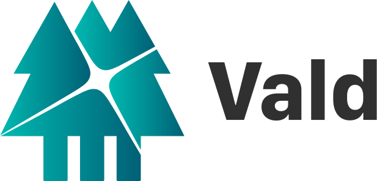

<div align="center">

</div>

[](https://opensource.org/licenses/Apache-2.0)
[](https://github.com/vdaas/vald/releases/latest)
[](https://pkg.go.dev/github.com/vdaas/vald)
[](https://www.codacy.com/app/i.can.feel.gravity/vald?utm_source=github.com&utm_medium=referral&utm_content=vdaas/vald&utm_campaign=Badge_Grade)
[](https://goreportcard.com/report/github.com/vdaas/vald)
[](https://depshield.github.io)
[](https://app.fossa.com/projects/git%2Bgithub.com%2Fvdaas%2Fvald?ref=badge_small)
[](https://deepsource.io/gh/vdaas/vald/?ref=repository-badge)
[](https://cla-assistant.io/vdaas/vald)
[](https://join.slack.com/t/vald-community/shared_invite/zt-db2ky9o4-R_9p2sVp8xRwztVa8gfnPA)
[](https://twitter.com/vdaas_vald)
<!--[](https://codecov.io/gh/vdaas/vald) -->

## What is Vald?

Vald is a highly scalable distributed fast approximate nearest neighbor dense vector search engine.

Vald is designed and implemented based on Cloud-Native architecture.

It uses the fastest ANN Algorithm [NGT](https://github.com/yahoojapan/NGT) to search neighbors.

Vald has automatic vector indexing and index backup, and horizontal scaling which made for searching from billions of feature vector data.

Vald is easy to use, feature-rich and highly customizable as you needed.

Go to [Get Started](./docs/tutorial/get-started.md) page to try out Vald :)

(If you are interested in ANN benchmarks, please refer to [the official website](http://ann-benchmarks.com/).)<br>

### Main Features

- Asynchronous Auto Indexing
    - Usually the graph requires locking during indexing, which causes stop-the-world. But Vald uses distributed index graphs so it continues to work during indexing.

- Customizable Ingress/Egress Filtering
    - Vald implements it's own highly customizable Ingress/Egress filter.
    - Which can be configured to fit the gRPC interface.
        - Ingress Filter: Ability to Vectorize through filter on request.
        - Egress Filter: rerank or filter the searching result with your own algorithm.

- Cloud-native based vector searching engine
    - Horizontal scalable on memory and CPU for your demand.

- Auto Backup for Index data
    - Vald has a feature to store the backup of the index data using MySQL or Cassandra which enables disaster recovery.

- Distributed Indexing
    - Vald distribute vector index to multiple agents, each agent stores different index.

- Index Replication
    - Vald stores each index in multiple agents which enables index replicas.
    - Automatically rebalance the replica when some Vald agent goes down.

- Easy to use
    - Vald can be easily installed in a few steps.

- Highly customizable
    - You can configure the number of vector dimensions, the number of replica and etc.

- Multi language supported
    - Go, Java, Clojure, Node.js, and Python client library are supported.
    - gRPC APIs can be triggered by any programming languages which support gRPC.
    - REST API is also supported.```

## Requirement

kubernetes 1.17~

## Get Started

Please refer to [Get Started](./docs/tutorial/get-started.md).

## Installation

### Using Helm

```shell
helm repo add vald https://vald.vdaas.org/charts
helm install vald-cluster vald/vald
```

If you use the default values.yaml, the `nightly` images will be installed.

#### Docker image tagging policy

- `nightly` ... latest build of master branch
- `vX.X.X` ... released versions
- `latest` ... latest build of release versions
- `stable` ... latest long-term supported version

### Using Helm-operator

[vald-helm-operator](https://github.com/vdaas/vald/blob/master/charts/vald-helm-operator)

## Example

```shell
Write example here
```

## Architecture Overview

<div align="center">

</div>

Please refer [here](./docs/overview/architecture.md) for more details of the architecture overview in the future.

## Development

Before your first commit to this repository, it is strongly recommended to run the commands below.

```shell
make init
```

## Components
<table>
  <tr>
    <th>component</th>
    <th>implementation</th>
    <th>Docker name</th>
    <th>Docker build status</th>
  </tr>
  <tr>
    <td rowspan=2>agent</td>
    <td>NGT</td>
    <td><a href="https://hub.docker.com/r/vdaas/vald-agent-ngt">vdaas/vald-agent-ngt</a></td>
    <td></td>
  </tr>
  <tr>
    <td>sidecar</td>
    <td><a href="https://hub.docker.com/r/vdaas/vald-agent-sidecar">vdaas/vald-agent-sidecar</a></td>
    <td></td>
  </tr>
  <tr>
    <td>discoverer</td>
    <td>K8s</td>
    <td><a href="https://hub.docker.com/r/vdaas/vald-discoverer-k8s">vdaas/vald-discoverer-k8s</a></td>
    <td></td>
  </tr>
  <tr>
    <td>gateway</td>
    <td></td>
    <td><a href="https://hub.docker.com/r/vdaas/vald-gateway">vdaas/vald-gateway</a></td>
    <td></td>
  </tr>
  <tr>
    <td rowspan=2>backup manager</td>
    <td>MySQL</td>
    <td><a href="https://hub.docker.com/r/vdaas/vald-manager-backup-mysql">vdaas/vald-manager-backup-mysql</a></td>
    <td></td>
  </tr>
  <tr>
    <td>Cassandra</td>
    <td><a href="https://hub.docker.com/r/vdaas/vald-manager-backup-cassandra">vdaas/vald-manager-backup-cassandra</a></td>
    <td></td>
  </tr>
  <tr>
    <td>compressor</td>
    <td></td>
    <td><a href="https://hub.docker.com/r/vdaas/vald-manager-compressor">vdaas/vald-manager-compressor</a></td>
    <td></td>
  </tr>
  <tr>
    <td rowspan=2>meta</td>
    <td>Redis</td>
    <td><a href="https://hub.docker.com/r/vdaas/vald-meta-redis">vdaas/vald-meta-redis</a></td>
    <td></td>
  </tr>
  <tr>
    <td>Cassandra</td>
    <td><a href="https://hub.docker.com/r/vdaas/vald-meta-cassandra">vdaas/vald-meta-cassandra</a></td>
    <td></td>
  </tr>
  <tr>
    <td>index manager</td>
    <td></td>
    <td><a href="https://hub.docker.com/r/vdaas/vald-manager-index">vdaas/vald-manager-index</a></td>
    <td></td>
  </tr>
  <tr>
    <td>helm-operator</td>
    <td></td>
    <td><a href="https://hub.docker.com/r/vdaas/vald-helm-operator">vdaas/vald-helm-operator</a></td>
    <td></td>
  </tr>
  <tr>
    <td>loadtester</td>
    <td></td>
    <td><a href="https://hub.docker.com/r/vdaas/vald-loadtest">vdaas/vald-loadtest</a></td>
    <td></td>
  </tr>
</table>

## Contribution

Please read the [contribution guide](https://github.com/vdaas/vald/blob/master/CONTRIBUTING.md)

## Contributors
<!-- ALL-CONTRIBUTORS-BADGE:START - Do not remove or modify this section -->
[](#contributors)
<!-- ALL-CONTRIBUTORS-BADGE:END -->

Thanks goes to these wonderful people ([emoji key](https://allcontributors.org/docs/en/emoji-key)):
<!-- ALL-CONTRIBUTORS-LIST:START - Do not remove or modify this section -->
<!-- prettier-ignore-start -->
<!-- markdownlint-disable -->
<table>
  <tr>
    <td align="center"><a href="http://kpango.com"><br /><sub><b>Yusuke Kato</b></sub></a><br /><a href="https://github.com/vdaas/vald/commits?author=kpango" title="Code">💻</a> <a href="#ideas-kpango" title="Ideas, Planning, & Feedback">🤔</a> <a href="#maintenance-kpango" title="Maintenance">🚧</a> <a href="#projectManagement-kpango" title="Project Management">📆</a></td>
    <td align="center"><a href="https://github.com/rinx"><br /><sub><b>Rintaro Okamura</b></sub></a><br /><a href="https://github.com/vdaas/vald/commits?author=rinx" title="Code">💻</a> <a href="https://github.com/vdaas/vald/commits?author=rinx" title="Documentation">📖</a> <a href="#maintenance-rinx" title="Maintenance">🚧</a> <a href="#platform-rinx" title="Packaging/porting to new platform">📦</a></td>
    <td align="center"><a href="https://morimoto.dev/"><br /><sub><b>Kosuke Morimoto</b></sub></a><br /><a href="https://github.com/vdaas/vald/commits?author=kmrmt" title="Code">💻</a> <a href="#example-kmrmt" title="Examples">💡</a> <a href="#tool-kmrmt" title="Tools">🔧</a> <a href="https://github.com/vdaas/vald/commits?author=kmrmt" title="Tests">⚠️</a></td>
    <td align="center"><a href="https://github.com/vankichi"><br /><sub><b>Kiichiro YUKAWA</b></sub></a><br /><a href="https://github.com/vdaas/vald/commits?author=vankichi" title="Documentation">📖</a> <a href="#maintenance-vankichi" title="Maintenance">🚧</a> <a href="https://github.com/vdaas/vald/commits?author=vankichi" title="Tests">⚠️</a> <a href="#tutorial-vankichi" title="Tutorials">✅</a></td>
    <td align="center"><a href="https://github.com/datelier"><br /><sub><b>datelier</b></sub></a><br /><a href="https://github.com/vdaas/vald/commits?author=datelier" title="Code">💻</a> <a href="#ideas-datelier" title="Ideas, Planning, & Feedback">🤔</a></td>
    <td align="center"><a href="https://github.com/kevindiu"><br /><sub><b>Kevin Diu</b></sub></a><br /><a href="https://github.com/vdaas/vald/commits?author=kevindiu" title="Documentation">📖</a> <a href="#example-kevindiu" title="Examples">💡</a> <a href="https://github.com/vdaas/vald/commits?author=kevindiu" title="Tests">⚠️</a> <a href="#tutorial-kevindiu" title="Tutorials">✅</a></td>
    <td align="center"><a href="https://twitter.com/hiroto_hlts2"><br /><sub><b>Hiroto Funakoshi</b></sub></a><br /><a href="https://github.com/vdaas/vald/commits?author=hlts2" title="Documentation">📖</a> <a href="#tool-hlts2" title="Tools">🔧</a> <a href="https://github.com/vdaas/vald/commits?author=hlts2" title="Tests">⚠️</a> <a href="#tutorial-hlts2" title="Tutorials">✅</a></td>
  </tr>
  <tr>
    <td align="center"><a href="https://github.com/taisuou"><br /><sub><b>taisho</b></sub></a><br /><a href="#design-taisuou" title="Design">🎨</a> <a href="https://github.com/vdaas/vald/commits?author=taisuou" title="Documentation">📖</a> <a href="#example-taisuou" title="Examples">💡</a></td>
    <td align="center"><a href="https://github.com/pgrimaud"><br /><sub><b>Pierre Grimaud</b></sub></a><br /><a href="https://github.com/vdaas/vald/commits?author=pgrimaud" title="Documentation">📖</a></td>
  </tr>
</table>

<!-- markdownlint-enable -->
<!-- prettier-ignore-end -->
<!-- ALL-CONTRIBUTORS-LIST:END -->

## LICENSE

vald released under Apache 2.0 license, refer [LICENSE](https://github.com/vdaas/vald/blob/master/LICENSE) file.

[](https://app.fossa.io/projects/git%2Bgithub.com%2Fvdaas%2Fvald?ref=badge_large)
