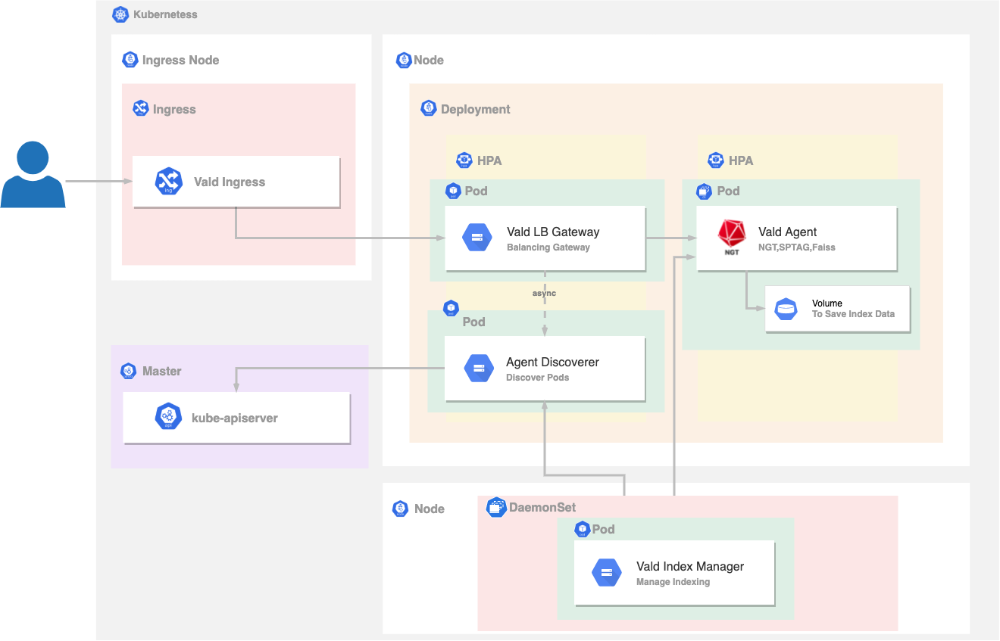

# Vald Architecture <!-- omit in toc -->

This document describes the high-level architecture design of Vald and explains each component in Vald.

## Overview

Vald uses a cloud-native architecture focusing on [Kubernetes](https://kubernetes.io/).
Some components in Vald use Kubernetes API to control the behavior of distributed vector indexes.
Before reading this document, you need to have some understanding of the basic idea of cloud-native architecture and Kubernetes.

### Technologies used by Vald

Vald is based on the following techologies.

- [Kubernetes](https://kubernetes.io/)

To easily scale and manage Vald, we deploy and run Vald on [Kubernetes](https://kubernetes.io/).
Vald takes all of the advantages of using Kuberenetes. For more details please read the next section.

- [Helm](https://helm.sh/)

Helm help you to deploy and configure Vald. 
Vald contains multiple components and configuration, Helm help us to manage those manifest and provide a better and easy way to deploy and configure Vald.

- [NGT](https://github.com/yahoojapan/NGT)

NGT is one of the core component of Vald. NGT is a super fast vector search engine used by Vald to guarantee the performance of Vald.

### Concept

Here are the concepts of Vald.

- Microservice based

  Vald is designed based on the microservice architecture. Vald components are highly decoupled into small components and connected, which increases the overall agility and maintainability of Vald.

- Containerized

  All components in Vald are containerized, which means you can easily deploy Vald components on any environment.

- Observability & Real-time monitoring

  All Vald components support Cloud-Native based observability features such as Prometheus and Jaeger exporter.

- Distributed vector spaces

  All the vector data and indexes are distributed to Vald Agents in the Vald cluster. Whenever you search a vector in Vald cluster, all Vald agents can process parallelly and merge the result by Vald LB Gateway.

- Kubernetes based

  Vald can integrate with Kubernetes which enables the following features.

  - Orchestrated

    Kubernetes supports container orchestration. All components in Vald can be managed by Kubernetes automatically.

  - Horizontal scalable

    All Vald components are designed and implemented to be scalable. You can add any node in Kubernetes cluster at any time to scale your Kuberentes cluster, or changing the number of replicas to scale Vald.

  - Auto-healing

    Kubernetes supports the auto-healing feature. The pod can start a new instance automatically whenever the pod is down.

  - Data persistency

    Vald implements backup features. Whenever a Vald Agent is down and kubernetes start a new Vald Agent instance, the data is automatically restored to the new instance to prevent data loss.

  - Easy to manage

    Vald can be deployed easily on your Kubernetes cluster by using Helm charts. The custom resources and custom controllers are useful to manage your Vald cluster.

## Basic Architecture

Vald is base on microservice, which means Vald is composited by multiple components, you can deploy part of the components to your cluster depending on your needs.
In this section, we will introduce the minimal architecture of Vald.

We will introduce each component and why it is needed in Vald.

### Vald Agent

Vald Agent is the core engine of Vald, the approximate nearest neighbor search engine. Agent-NGT uses yahoojapan/NGT as a core library.

### Vald LB Gateway

Vald LB Gateway is a gateway to load balance the user request and forward user request to the Vald-Agent base on the resource usage of the Vald-Agent and the corresponding cluster node.

### Vald Discoverer

Vald Discoverer provides Vald Agent discovery service to discover active Vald Agents in the Kubernetes cluster.
It also retrieves the corresponding Vald Agent resources usage for Vald LB gateway to determine the priority of which Vald Agent handles the user request.

### Vald Index Manager

Vald Index Manager controls the timing of the indexing of the Vald Agent. The index is used to increase the performance of the search action.

It retrieves the active Vald Agent pods from the Vald Discoverer and triggers the indexing action on each Vald Agent.
