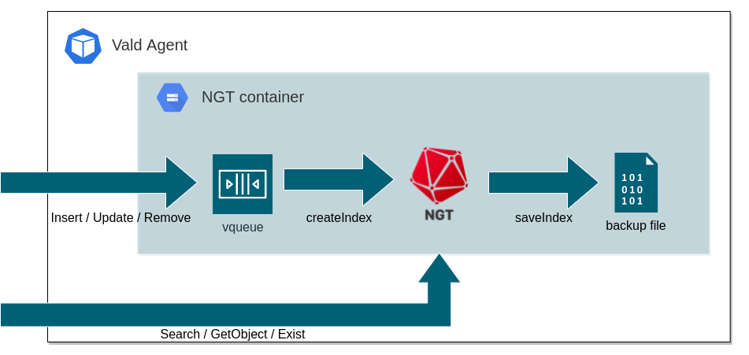
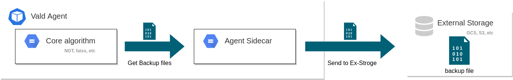
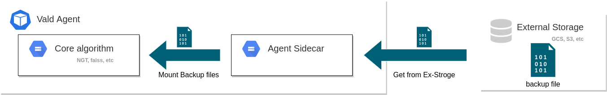

# Vald Agent

Vald Agent is the core component of the Vald cluster.

Mainly, it consists of 1 or 2 small components, Vald Core and Vald Agent sidecar, depending on the use case.

This page introduces the overview and features of Vald Agent.

## Responsibility

Vald Agent is responsible for:

- Store index data along to the user requests
  - The store destination is In-Memory, Volume Mounts, Persistent Volume, or External Storage.
- Search the nearest neighbor vectors of the request vector and return the search result

## Features

Vald Agent has two components, `core` and `sidecar`.

This chapter shows the characteristics of each small component.

### Core

`Core` is responsible for the main features of Vald Agent.

It uses a specific algorithm, and you can choose one algorithm depending on your needs.

Vald provides:

- Vald Agent NGT

as core algorithm layer.

#### Vald Agent NGT

Vald Agent NGT uses [NGT](https://github.com/yahoojapan/NGT) as an algorithm.

The main functions are the followings:

- Insert
  - Request to insert new vectors into the NGT.
  - Requested vectors are stored in the `vqueue`.
- Search
  - Get the nearest neighbor vectors of the request vector from NGT indexes.
- Update
  - Create a request to update the specific vectors to the new vectors.
  - Requested vectors are stored in the `vqueue`.
- Remove
  - Create a request to remove the specific vectors from NGT indexes.
  - Requested vectors are stored in the `vqueue`.
- GetObject
  - Get the information on the indexed vectors.
- Exist
  - Check whether the specific vectors are already inserted or not.
- CreateIndex
  - Create a new NGT index structure in memory using vectors stored in the `vqueue` and the existing NGT index structure if it exists.
- SaveIndex
  - Save metadata about NGT index information to the internal storage.

You have to control the duration of CreateIndex and SaveIndex by configuration.

These methods don’t always run when getting the request.

As you see, Vald Agent NGT can only search the nearest neighbors from the NGT index.

You have to wait to complete the CreateIndex and SaveIndex functions before searching.

This image shows the mechanism to create NGT index.

Please refer to [Go Doc](https://pkg.go.dev/github.com/vdaas/vald@v1.3.1/pkg/agent/core/ngt/service) for other functions.

#### Vald Agent Faiss

Vald Agent Faiss uses [Faiss](https://github.com/facebookresearch/faiss) as an algorithm.

The main functions are the followings:

- Insert
  - Request to insert new vectors into the Faiss.
  - Requested vectors are stored in the `vqueue`.
  - Cache a fixed number of verctors for Faiss training.
  - Once Faiss trained in CreateIndex, the vector is never cached for Faiss training.
- Search
  - Get the nearest neighbor vectors of the request vector from Faiss indexes.
  - radius/epsilon is search config for NGT and has no meaning in Faiss.
- Update
  - Create a request to update the specific vectors to the new vectors.
  - Requested vectors are stored in the `vqueue`.
- Remove
  - Create a request to remove the specific vectors from Faiss indexes.
  - Requested vectors are stored in the `vqueue`.
- Exist
  - Check whether the specific vectors are already inserted or not.
- CreateIndex
  - Create a new Faiss index structure in memory using vectors stored in the `vqueue` and the existing Faiss index structure if it exists.
  - If a certain number of vectors required for Faiss training are not cached, they will not be trained.
  - if Faiss is not trained, no index is generated.
- SaveIndex
  - Save metadata about Faiss index information to the internal storage.

Unimplemented functions are the followings:

- GetObject
- SearchByID
- StreamXXX
- MultiXXX

Same as Agent NGT, You have to control the duration of CreateIndex and SaveIndex by configuration.

These methods don’t always run when getting the request.

As you see, Vald Agent Faiss can only search the nearest neighbors from the Faiss index.

You have to wait to complete the CreateIndex and SaveIndex functions before searching.

### Sidecar

`Sidecar` saves the index metadata file to external storage like Amazon S3 or Google Cloud Storage.

The main functions are:

- Backup
  - When `Agent Core` completes creating the index metadata files, `Sidecar` hooks to store them in the external storage.

- Restore
  - When the Vald Agent Pod restarts, the index structure is restored from the external backup files.

<!-- Add configuration guide link for agent -->
