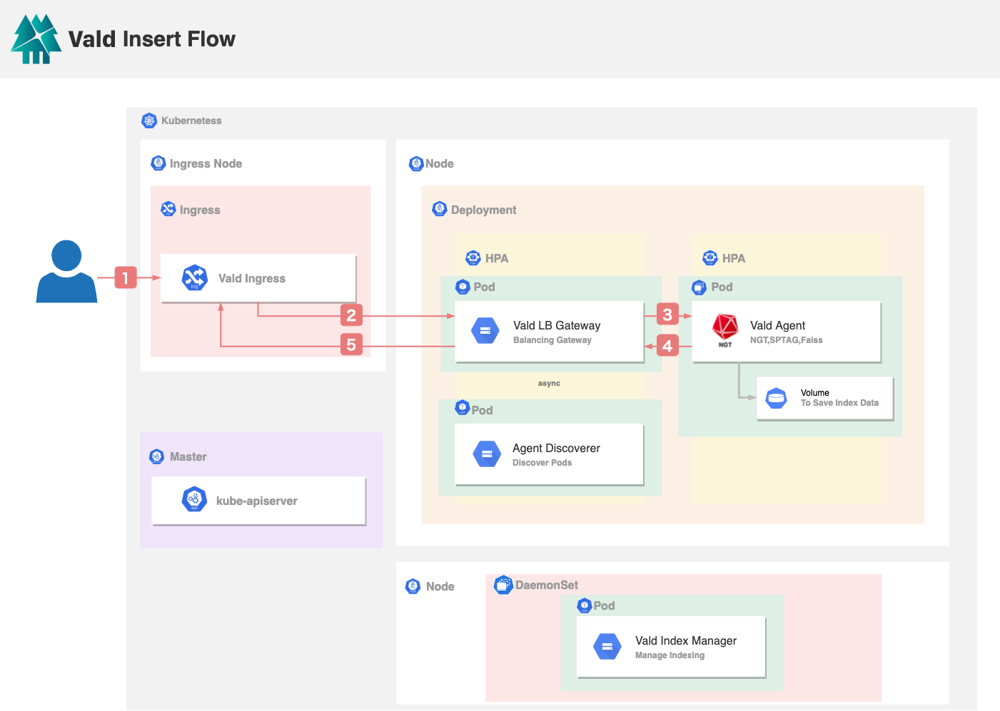
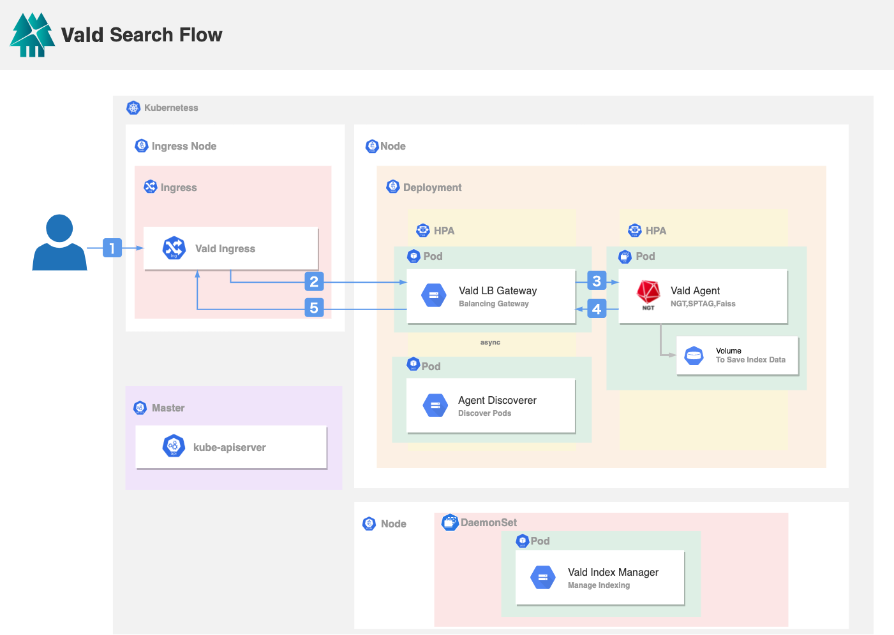
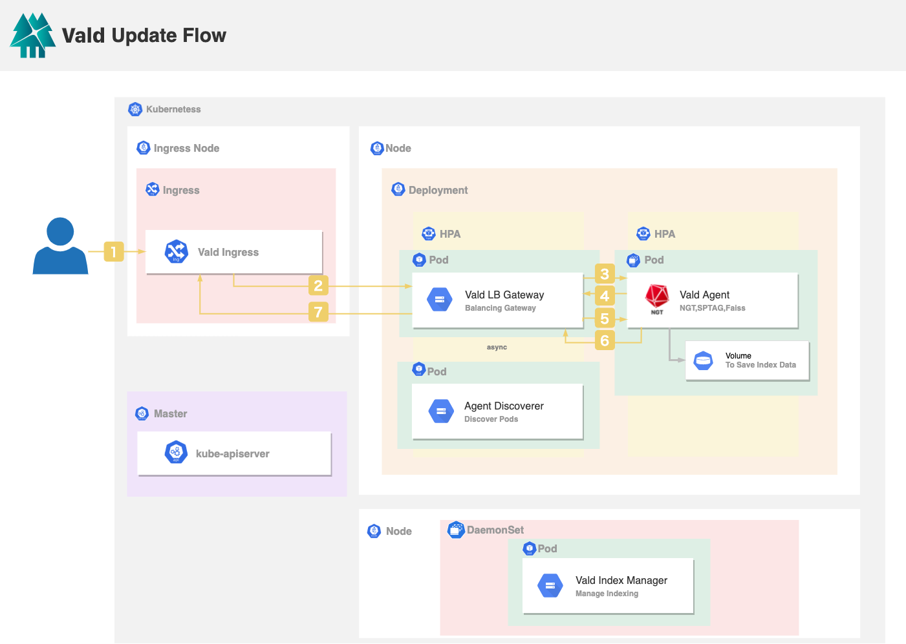
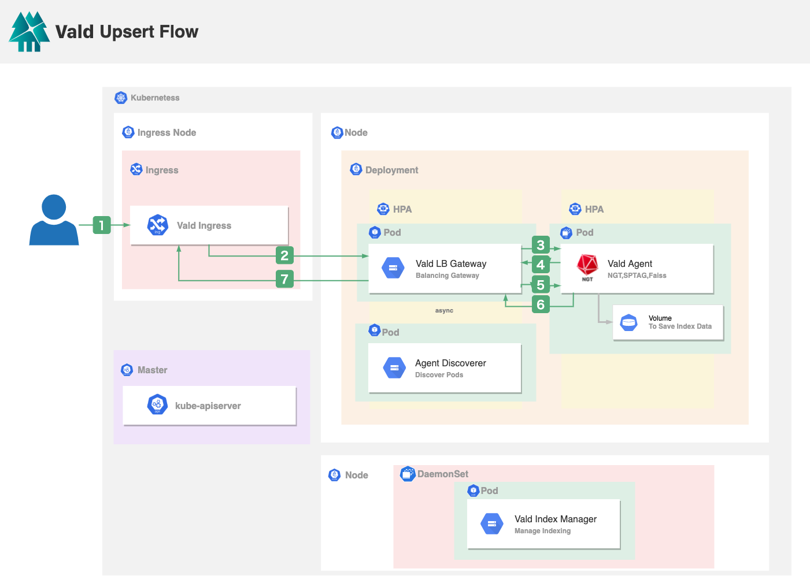

# Data Flow

This section describes the data flow inside Vald and how Vald's vector indexes are stored.
This is the most important part for the users to understand Vald.

The below image is the overview of Vald's architecture.

We will explain this image in the following sections.

## Insert

When the user inserts data into Vald:

1. Vald Ingress receives the request from the user. The request includes the vector and the vector ID.
2. Vald Ingress will forward the request to the Vald LB Gateway to process the request. Vald LB Gateway will determine which Vald Agent(s) to process the request based on the resource usage of the nodes and pods, and the number of vector replicas.
3. Vald LB Gateway will forward the UUID and the vector data to the selected Vald Agents in parallel. Vald Agent will insert the vector and UUID in an on-memory vector queue. A vector queue will be committed to an ANN graph index by a `CreateIndex` instruction executed by the Vald Index Manager.
4. If Vald Agent successfully inserts the request data, it will return success to the Vald LB Gateway.
5. After Vald LB Gateway receives success from the selected Vald Agents, it will respond the IP addresses of all selected Vald Agents to the Vald LB Gateway, and return success to the Vald Ingress.

## Search

When the user searches a vector from Vald:

1. Vald Ingress receives a search request from the user. Vald provides 2 searching interfaces to the user, the user can search by vector or search by the vector ID.
2. Vald Ingress will forward the request to the Vald LB Gateway to process the request.
3. Vald LB Gateway will forward the request to all Vald Agents in parallel. Each Vald Agent will search the _k_ nearest neighbor vectors in an on memory graph index.
4. Vald Agent returns the searching result to the Vald LB Gateway. The searching result includes the UUID, the vector distance, and the vector. The number of the result will be the same as requested.
5. Vald LB Gateway will aggregate all searching results from all Vald Agents, rank the result by the vector distance, and return the ranked result to the Vald Ingress.

## Update

When the user updates a vector from Vald:

1. Vald Ingress receives the request from the user. The request includes the existing vector ID(s) and the new vector(s) to be updated.
2. Vald Ingress will forward the request to the Vald LB Gateway to process the request.
3.  Vald LB Gateway will broadcast the delete request with UUID(s) to the Vald Agents. Each Vald Agent will delete the vector data and the metadata if the corresponding UUID(s) is found in the in-memory graph index.
4.  Each Vald Agent will return success to the Vald LB Gateway if it deletes the request data successfully.
5.  The insertion step will start after the deletion steps. Vald LB Gateway will determine which Vald Agent(s) to process the request based on the resource usage of the nodes and pods, and the number of vector replicas. Vald LB Gateway will forward each set of the UUID and the vector data to the selected Vald Agents in parallel. Vald Agent will insert the vector(s) and the UUID(s) in an in-memory vector queue. A vector queue will be committed to the graph index by a `CreateIndex` instruction which will be executed by the Vald Index Manager.
6.  If Vald Agent successfully inserts the request data, it will return success (e.g. IP address of pod) to the Vald LB Gateway.
7.  Vald Filter Gateway will return success to the Vald Ingress.

## Upsert

Upsert request updates the existing vector if the same vector ID exists, or inserts the vector into Vald.
When the user upsert a vector to Vald:

1. Vald Ingress receives the request from the user. The request includes the vector ID(s) and the vector(s).
2. Vald Ingress will forward the request to the Vald LB Gateway to process the request.
3. Vald LB Gateway will boardcast a exist check request to Vald Agent(s) to check if the vector exists.
4. Vald Agent returns the exist check result to Vald LB Gateway.
5. If the vector with the same vector ID exists, Vald LB Gateway will send a update request to Vald Agent(s) same as the update flow step 3 to step 5. If the vector does not exist, Vald LB Gateway will process the insert flow from step 3 to step 4.
6. Vald Agent(s) return sucess to Vald LB Gateway.
7. Vald Filter Gateway will return success to the Vald Ingress.

## Delete

When the user deletes a vector which is indexed in Vald Agent:

1. Vald Ingress receives the delete request from the user. The request includes the vector ID(s), which is specified by the user.
2. Vald Ingress will forward the request to the Vald LB Gateway.
3. Vald LB Gateway will broadcast the delete request with UUID(s) to the Vald Agents. Each Vald Agent will delete the vector data and the metadata if the corresponding UUID(s) is found in the in-memory graph index.
4. If Vald Agent successfully deletes the request data, it will return success to the Vald LB Gateway.
5.  Vald LB Gateway will return success to the Vald Ingress.
