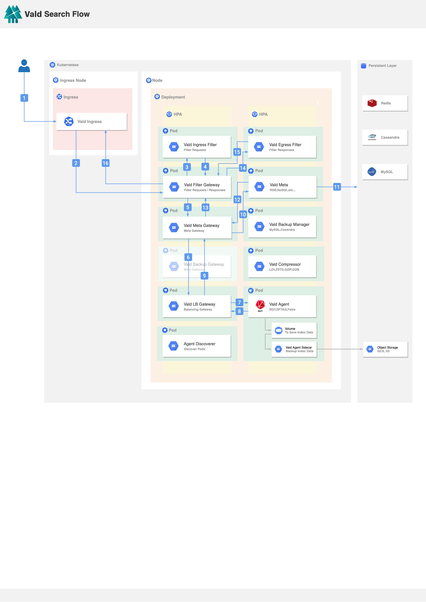
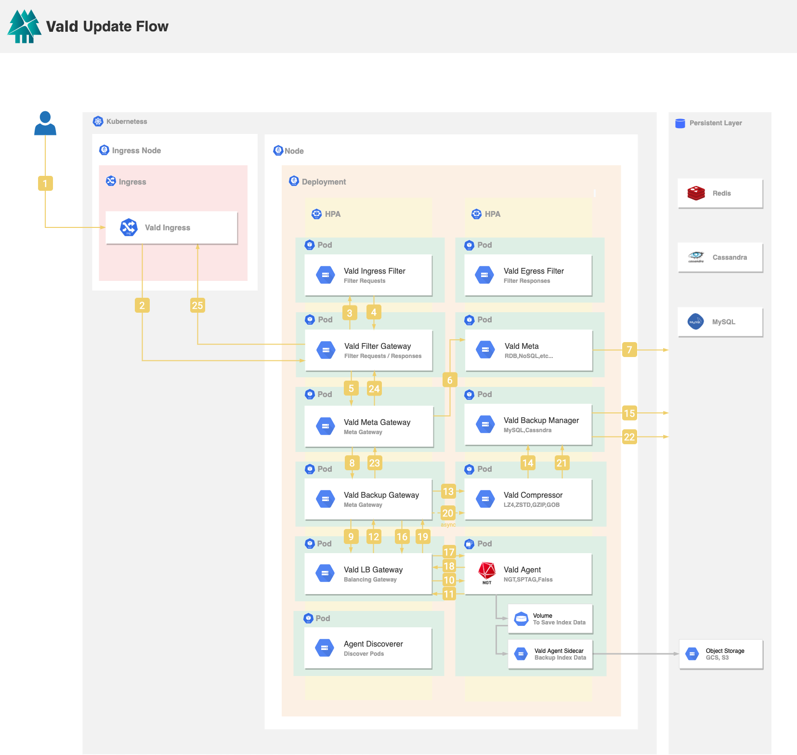
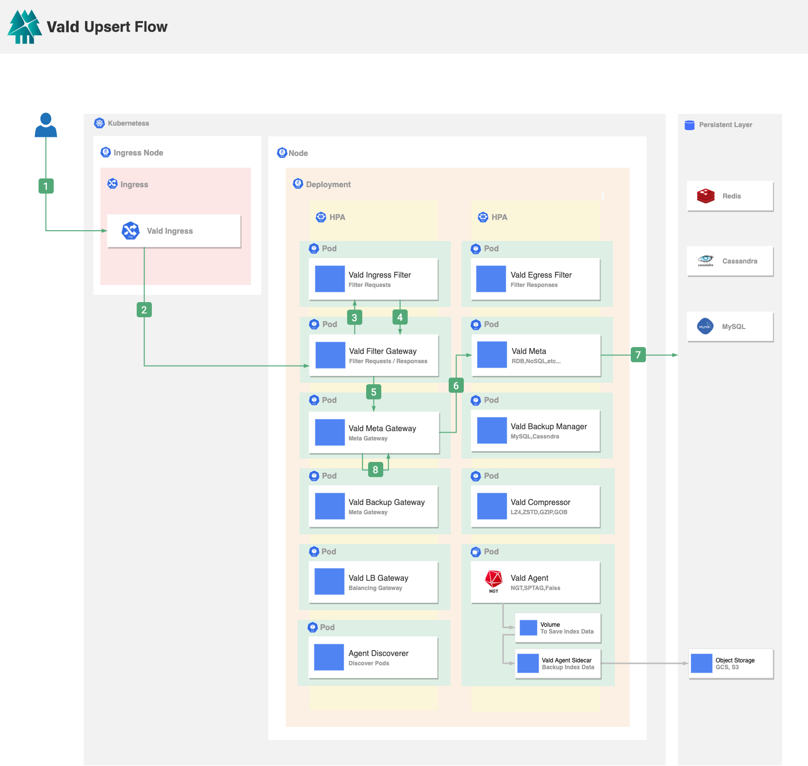
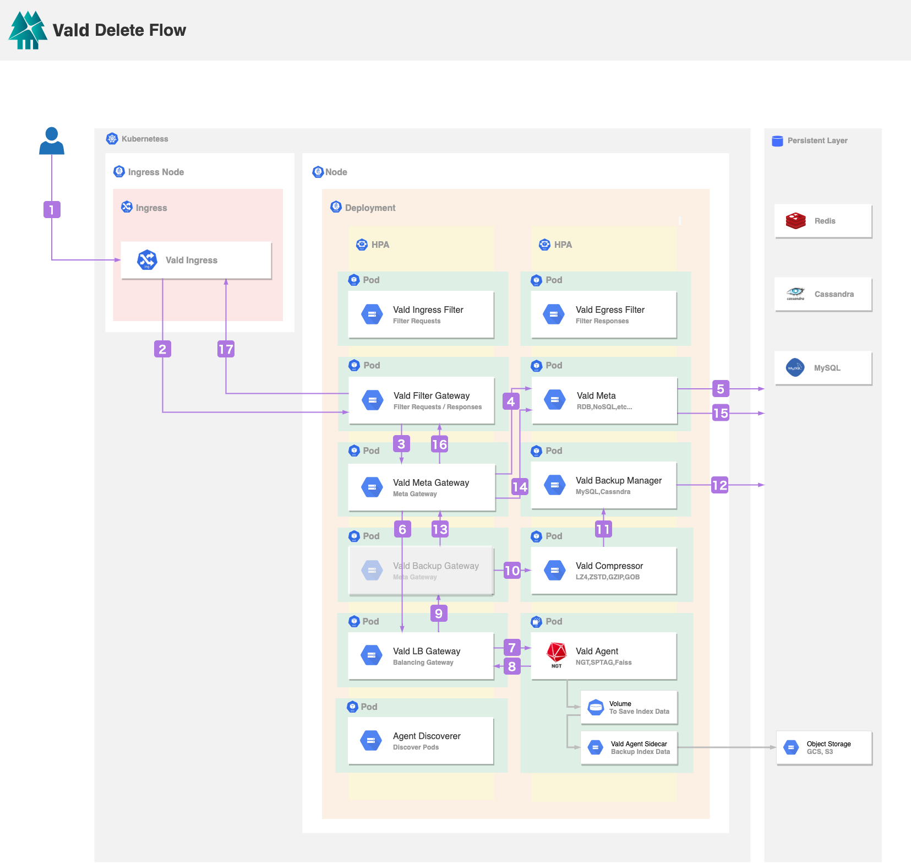

# Data Flow

This section describes the data flow inside Vald and how Vald's vector indexes are stored.
This is the most important part for the users to understand Vald.

The below image is the overview of Vald's architecture.

We will explain this image in the following sections.

## Insert

When the user inserts data into Vald:

1. Vald Ingress receives the request from the user. The request includes the vector and the vector ID.
2. Vald Ingress will forward the request to the Vald LB Gateway to process the request data. Vald LB Gateway will determine which Vald Agent(s) to process the request based on the resource usage of the nodes and pods, and the number of vector replicas.
3. Vald LB Gateway will forward the UUID and the vector data to the selected Vald Agents in parallel. Vald Agent will insert the vector and UUID in an on-memory vector queue. A vector queue will be committed to an ANN graph index by a `CreateIndex` instruction executed by the Vald Index Manager.
4. If Vald Agent successfully inserts the request data, it will return success to the Vald LB Gateway.
5. After Vald LB Gateway receives success from the selected Vald Agents, it will respond the IP addresses of all selected Vald Agents to the Vald Backup Gateway, and return success to the Vald Ingress.

## Search

When the user searches a vector from Vald:

1. Vald Ingress receives a search request from the user. Vald provides 2 searching interfaces to the user, the user can search by vector or search by the vector ID.
2. Vald Ingress will forward the request to the Vald Filter Gateway to pre-process the request data.
3. Vald Filter Gateway will forward the request to the user-defined Vald Ingress Filter. After the Vald Ingress Filter received the request, it will perform the pre-processing logic defined by the user, for example, padding the vector to match the vector dimension in Vald.
4. After the request is processed by the user-defined Vald Ingress Filter, the result will return to the Vald Filter Gateway.
5. Vald Filter Gateway will forward the request to the Vald Meta Gateway. Vald Meta Gateway is used to resolve the internal used UUID to the user inserted vector ID in step 10-11.
6. Vald Meta Gateway will forward the request to the Vald LB Gateway through the Vald Backup Gateway. Vald LB Gateway will preform the post-processing of the result in step 9 after the Vald Agent(s) return in step 8.
7. Vald LB Gateway will forward the request to all Vald Agents in parallel. Each Vald Agent will search the _k_ nearest neighbor vectors in an on memory graph index.
8. Vald Agent returns the searching result to the Vald LB Gateway. The searching result includes the UUID, the vector distance, and the vector. The number of the result will be the same as requested.
9. Vald LB Gateway will aggregate all searching results from all Vald Agents, rank the result by the vector distance, and return the ranked result to the Vald Meta Gateway through the Vald Backup Gateway.
10. Vald Meta Gateway will forward the searching result to the Vald Meta to resolve the user-defined vector IDs from the internal used UUIDs.
11. Vald Meta will perform a search for the Vector IDs based on the internal used UUIDs.
12. Vald Meta will return the Vector IDs to the Vald Meta Gateway.
13. Vald Meta Gateway will combine the vectors and the vector IDs from the searching result and return to the Vald Filter Gateway.
14. Vald Filter Gateway will forward the request to the user-defined Vald Egress Filter to filter the final result. For example exclude the specific type of the result from the vector ID.
15. Vald Egress Filter will return the filtered result to the Vald Filter Gateway.
16. Vald Filter Gateway will return the final result to the Vald Ingress.

## Update

When the user updates a vector from Vald:

1. Vald Ingress receives the request from the user. The request includes the existing vector ID(s) and the new vector(s) to be updated.
2. Vald Ingress will forward the request to the Vald Filter Gateway to pre-process the request data.
3. Vald Filter Gateway will forward the request to the user-defined Vald Ingress Filter. After the Vald Ingress Filter received the request, it will perform the pre-processing logic defined by the user, for example, padding the vector to match the vector dimension in Vald.
4. After the request is processed by the user-defined Vald Ingress Filter, the result will return to the Vald Filter Gateway.
5. Vald Filter Gateway will forward the processed data to the Vald Meta Gateway. Vald Meta Gateway is used to resolve the internal used UUID(s) from Vald Meta to the user inserted vector ID(s) in the Insert Step.
6. Vald Meta Gateway will forward the request to the Vald Meta to confirm whether the metadata, which contains the vector ID(s), exists or not.
7. Vald Meta gets the UUID(s) by vector ID(s). It returns an error if no UUID(s) is found.
8. If Vald Meta Gateway gets the UUID(s), Vald Meta Gateway will forward the request with the UUID(s) to the Vald Backup Gateway.
9. Vald Backup Gateway splits the update step into the deletion step and the insertion step. First is the deletion step. Vald Backup Gateway will forward the deletion request with the UUID(s) to the Vald LB Gateway.
10. Vald LB Gateway will broadcast the request with UUID(s) to the Vald Agents. Each Vald Agent will delete the vector data and the metadata if the corresponding UUID(s) is found in the in-memory graph index.
11. Each Vald Agent will return success to the Vald LB Gateway if it deletes the request data successfully.
12. After Vald LB Gateway receives success with the location info (e.g. IP address of pod) from the Vald Agent, Vald LB Gateway will return success to the Vald Backup Gateway.
13. Vald Backup Gateway will forward the request with the UUID(s) to the Vald Compressor.
14. Vald Compressor will forward the UUID(s) to the Vald Backup Manager.
15. Vald Backup Manager will delete the data with the same UUID(s).
16. The insertion step described in 9 will start after the deletion steps. Vald Backup Gateway will forward the insertion request to the Vald LB Gateway. Vald LB Gateway will determine which Vald Agent(s) to process the request based on the resource usage of the nodes and pods, and the number of vector replicas.
17. Vald LB Gateway will forward each set of the UUID and the vector data to the selected Vald Agents in parallel. Vald Agent will insert the vector(s) and the UUID(s) in an in-memory vector queue. A vector queue will be committed to the graph index by a `CreateIndex` instruction which will be executed by the Vald Index Manager.
18. If Vald Agent successfully inserts the request data, it will return success (e.g. IP address of pod) to the Vald LB Gateway.
19. After Vald LB Gateway receives success from the selected Vald Agents, it will return IP addresses of all selected Vald Agents to the Vald Backup Gateway.
20. Vald Backup Gateway will asynchronously send all the inserted data (including vector, vector ID, UUID and IP address) to the Vald Compressor. Vald Compressor will compress the vector data asynchronously to reduce the size of the vector data.
21. Vald Compressor will forward all the compressed data (including compressed vector, vector ID, UUID and IP address) to the Vald Backup Manager.
22. Vald Backup Manager will store all of the data to the persistent layer such as MySQL, Cassandra, etc., to prevent the data lost in Vald.
23. Vald Backup Gateway returns success to the Vald Meta Gateway.
24. Vald Meta Gateway will return success to the Vald Filter Gateway.
25. Vald Filter Gateway will return success to the Vald Ingress.

## Upsert

Upsert request updates the existing vector if the same vector ID exists, or inserts the vector into Vald.
When the user upsert a vector to Vald:

1. Vald Ingress receives the request from the user. The request includes the vector ID(s) and the vector(s).
2. Vald Ingress will forward the request to the Vald Filter Gateway to pre-process the request data.
3. Vald Filter Gateway will forward the request to the user-defined Vald Ingress Filter. After the Vald Ingress Filter received the request, it will perform the pre-processing logic defined by the user, for example, padding the vector to match the vector dimension in Vald.
4. After the request is processed by the user-defined Vald Ingress Filter, the result will return to the Vald Filter Gateway.
5. Vald Filter Gateway will forward the processed data to the Vald Meta Gateway. Vald Meta Gateway is used to check if the same vector with the same vector ID exists in Vald cluster.
6. Vald Meta Gateway will forward the request to the Vald Meta to check if the metadata, which contains the vector ID(s), exists or not.
7. Vald Meta gets the UUID(s) by vector ID(s). It returns an error if no UUID(s) is found.
8. If the vector with the same vector ID exists, Vald Meta Gateway will process the Update flow from step 5 to step 25. If the vector does not exist, Vald Meta Gateway will process the insert flow from step 5 to step 18.

## Delete

When the user deletes a vector which is indexed in Vald Agent:

1. Vald Ingress receives the delete request from the user. The request includes the vector ID(s), which is specified by the user.
2. Vald Ingress will forward the request to the Vald Filter Gateway.
3. Vald Filter Gateway will forward the request to the Vald Meta Gateway. Vald Meta Gateway is used to resolve the internal used UUID of the vector from the Vald Meta.
4. Vald Meta Gateway will forward the request to the Vald Meta to confirm whether the metadata, which contains the request ID(s), exists or not.
5. Vald Meta gets the UUID(s) by the request ID(s). Return error if no UUID(s) is found, return with the error.
6. If Vald Meta Gateway gets the UUID(s), Vald Meta Gateway will forward it to the request with the UUID(s) to the Vald Backup Gateway.
7. Vale Backup Gateway will forward the request with the UUID(s) to the Vald LB Gateway.
8. Vald LB Gateway will broadcast the request with UUID(s) to the Vald Agents. Each Vald Agent will delete the vector data and the metadata if the corresponding UUID(s) is found in the in-memory graph index.
9. If Vald Agent successfully deletes the request data, it will return success to the Vald LB Gateway.
10. After Vald LB Gateway receives success with location info (e.g, IP address of pod) from the Vald Agent, Vald LB Gateway will return success to the Vald Backup Gateway.
11. Vald Backup Gateway will forward the request with the UUID to the Vald Compressor.
12. Vald Compressor will forward the UUID(s) to the Vald Backup Manager.
13. Vald Backup Manager will delete the data with the same UUID(s).
14. Vald Backup Gateway will return success to the Vald Meta Gateway if the data is successfully deleted from the Vald Backup Manager.
15. Vald Meta Gateway will forward the UUID(s) to the Vald Meta.
16. Vald Meta will delete the data from the persistent layer if it is successfully deleted from the Vald Agents store the deleted UUID(s) and the deletion time in the persistent layer.
17. Vald Meta Gateway will return success to the Vald Filter Gateway.
18. Vald Filter Gateway will return success to the Vald Ingress.
