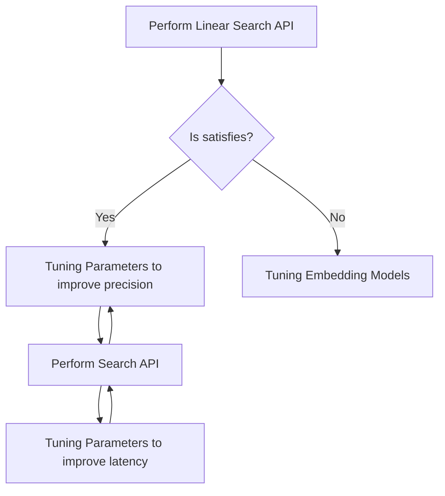

# Tuning Search Performance

ANN is fast, but sometimes it can be improved more by tuning parameters.
This page shows the essence for improve ANN search by the Vald cluster.

## Tuning Guideline

When the search results do NOT satisfy the expected result, it can be improved by tuning parameters.

First of all, we recommend tuning by following the steps below without doing it blindly.

The best practice is:

1. Measure [Linear Search](../../docs/api/search.md#linearsearch-rpc) performance and use it as a baseline for Search API
1. Repeat tuning to improve precision and measure Search API until the conditions are met
1. Repeat tuning to improve latency and measure Search API until the conditions are met

When the results are not good by Linear Search API, it may need to rethink the embedding model for vectorization.

## Tuning parameters

There are two viewpoints, client-side and cluster-side, for improving search performance.

There is a trade-off between search speed and accuracy, so tuning accuracy at first is recommended.

### Client side

On the client side, parameters of [`Search.Config`](../../docs/api/search.md#input) will affect the search result.

|             | description                                                                                                                   | how does it affect?                                                                                                                                                                                                    | memo                                                          |
| :---------- | :---------------------------------------------------------------------------------------------------------------------------- | :--------------------------------------------------------------------------------------------------------------------------------------------------------------------------------------------------------------------- | :------------------------------------------------------------ |
| radius      | the search radius for NGT [ref: search_radius](https://github.com/yahoojapan/NGT/tree/main/bin/ngt#search)                 | Define the search range when NGT searches the nearest neighbors                                                                                                                                                        | recommended value: `-1`                                       |
| epsilon     | the search coefficient for NGT [ref: search_range_coefficient](https://github.com/yahoojapan/NGT/tree/main/bin/ngt#search) | Expansion factor of the NGT search range. Search operation time increases when the epsilon is big.                                                                                                                  | recommended value range: `0.01 ~ 0.3` default value: `0.1` |
| timeout(ns) | max time duration until receiving search results.                                                                             | An error will be returned if the set `num` search results cannot be obtained within the set time. By setting `min_num`, the search results will be returned if more than `min_num` can be searched within the time. | default value: `3,000,000,000ns`                              |

### Cluster-side

On the cluster side, these parameters can be set by `values.yaml`, affect the search result.

|                              | description                                                                                                                                                  | how does it affect?                                                                                                                                                                        | Memo                |
| :--------------------------- | :----------------------------------------------------------------------------------------------------------------------------------------------------------- | :----------------------------------------------------------------------------------------------------------------------------------------------------------------------------------------- | :------------------ |
| agent.ngt.creation_edge_size | Number of nodes connected to one node [ref: no_of_edges](https://github.com/yahoojapan/NGT/tree/main/bin/ngt#create)                                      | It helps reduce unreachable edges. The larger it is, the denser the graph structure will be, but the memory usage, search speed, and index construction time will increase accordingly. | default value: `20` |
| agent.ngt.search_edge_size   | Number of nodes to search from the origin node when searching [ref: no_of_edges_at_search_at](https://github.com/yahoojapan/NGT/tree/main/bin/ngt#create) | The number of nodes to search will increase. Accuracy will be higher, but speed will be lower. Adjust if adjusting the radius and epsilon does not improve the situation.            | default value: `10` |
