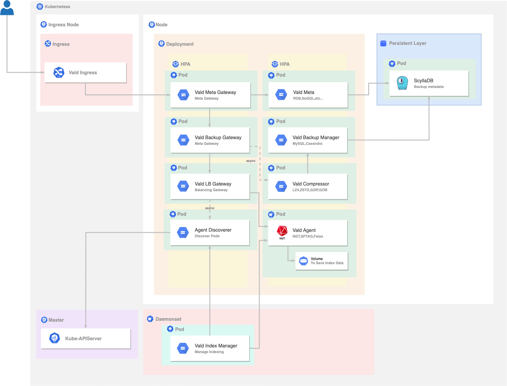

# Using Backup with SycllaDB

This article will show you how to deploy Vald with ScyallaDB as backup Database using Helm and run it on your Kubernetes cluster.

## Overview

This tutorial leads you to deploy Vald with using the external database for backup.
As one of the features, Vald can auto index backup using MySQL + Redis or Cassandra to enable disaster recovery.<br>
In this tutorial, you will use ScyllaDB deployed to the Persistent Volume for backup.
And you will also deploy more microservices than [Get Started](../tutorial/get-started.md).
If you haven't completed [Get Started](../tutorial/get-started.md) yet, we recommend to try it out at first.

The following image is the architecture image of this tutorial.



The 5 steps to Using Backup with Scylladb:
1. [Check and Satisfy the Requirements](#Requirements)
1. [Prepare Kubernetes Cluster](#Prepare-the-Kubernetes-Cluster)
1. [Deploy Vald on Kubernetes Cluster](#Deploy-Vald-on-Kubernetes-Cluster)
1. [Run Example Code](#Run-Example-Code)
1. [Cleanup](#Cleanup)

## Requirements

- Kubernetes: v1.19 ~
- go: v1.15 ~
- helm: v3 ~
- libhdf5 (_only required for this tutorial_)

Helm is used to deploying Vald on your Kubernetes and Hdf5 is used to decode the sample data file to run the example.<br>
If helm or hdf5 is not installed, please install [helm](https://helm.sh/docs/intro/install) and [hdf5](https://www.hdfgroup.org/).

<details><summary>Installation command for helm</summary><br>

```bash
curl https://raw.githubusercontent.com/helm/helm/master/scripts/get-helm-3 | bash
```

</details>

<details><summary>Installation command for hdf5</summary><br>

```bash
# yum
yum install -y hdf5-devel

# apt
apt-get install libhdf5-serial-dev

# homebrew
brew install hdf5
```

</details>

## Prepare the Kubernetes Cluster

1. Prepare Kubernetes cluster

    To complete get started, the kubernetes cluster is required.<br>
    Vald will run on Cloud Service such as GKE, AWS.
    In the sense of trying to "Get-Started", [k3d](https://k3d.io/) or [kind](https://kind.sigs.k8s.io/) are easy Kubernetes tools to use.

1. Prepare Scylla DB and kubernetes metrics-server

    Deploy Scylla as a backup database.

    ```bash
    make k8s/external/scylla/deploy
    ```

    In this make command, we are deploying a lightweight Cassandra-compatible scylladb using Operator.
    <details><summary>If you're interested in this make command, take a look here for more detail of make command</summary><br>

    1. Deploy cert-manager for ScyllaDB

    ```bash
    kubectl apply -f https://github.com/jetstack/cert-manager/releases/latest/download/cert-manager.yaml
    kubectl wait -n cert-manager --for=condition=ready pod -l app=cert-manager --timeout=60s
    kubectl wait -n cert-manager --for=condition=ready pod -l app=cainjector --timeout=60s
    kubectl wait -n cert-manager --for=condition=ready pod -l app=webhook --timeout=60s
    ```

    1. Deploy ScyllaDB Operator

    ```bash
    kubectl apply -f https://raw.githubusercontent.com/scylladb/scylla-operator/master/examples/common/operator.yaml
    kubectl wait -n scylla-operator-system --for=condition=ready pod -l statefulset.kubernetes.io/pod-name=scylla-operator-controller-manager-0 --timeout=600s
    ```

    1. Deploy ScyllaDB

    ```bash
    kubectl apply -f k8s/external/scylla/scyllacluster.yaml
    kubectl wait -n scylla --for=condition=ready pod -l statefulset.kubernetes.io/pod-name=vald-scylla-cluster-dc0-rack0-0 --timeout=600s
    kubectl -n scylla get pods
    ```

    1. Configure ScyllaDB

    ```bash

    kubectl apply -f example/manifest/scylla
    kubectl wait --for=condition=complete job/scylla-init --timeout=60s
    ```

    </details>

    For documentation on scylladb operator, please refer to [here](http://operator.docs.scylladb.com/master/generic)

1. Apply kubenetes metrics server

    ```bash
    kubectl apply -f https://github.com/kubernetes-sigs/metrics-server/releases/latest/download/components.yaml
    kubectl wait -n kube-system --for=condition=ready pod -l k8s-app=metrics-server --timeout=600s
    ```

## Deploy Vald on Kubernetes Cluster

This chapter will show you how to deploy using Helm and run Vald on your kubernetes cluster.<br>
This chapter uses Scylla DB as a backend data store for indexing and data backup.<br>
If you want to learn about Scylla, please refer to [the official website](https://www.scylladb.com/).

1. Clone the Repository

    To use the `deployment yaml` for deploy, let's clone [`vdaas/vald`](https://github.com/vdaas/vald.git) repository.

    ```bash
    git clone https://github.com/vdaas/vald.git
    cd vald
    ```

1. Confirm which Cluster to Deploy

   ```bash
   kubectl cluster-info
   ```

1. Deploy Vald Using Helm

    ```bash
    # add vald repo into helm repo
    helm repo add vald https://vald.vdaas.org/charts
    # deploy vald on your kubernetes cluster
    helm install vald vald/vald --values example/helm/values-scylla.yaml
    ```

1. Verify

    When finish deploy, you can check the Vald's pods status following command.

    ```bash
    kubectl get pods
    ```

    <details><summary>Example output</summary><br>
    If the deployment is successful, all Vald components should be running.

    ```bash
    NAME                                       READY   STATUS      RESTARTS   AGE
    scylla-init-vhdp5                          0/1     Completed   0          7m12s
    vald-agent-ngt-0                           1/1     Running     0          7m12s
    vald-agent-ngt-1                           1/1     Running     0          7m12s
    vald-agent-ngt-2                           1/1     Running     0          7m12s
    vald-agent-ngt-3                           1/1     Running     0          7m12s
    vald-agent-ngt-4                           1/1     Running     0          7m12s
    vald-agent-ngt-5                           1/1     Running     0          7m12s
    vald-backup-gateway-68c8b4ffd4-df8zp       1/1     Running     0          6m56s
    vald-backup-gateway-68c8b4ffd4-dmwrd       1/1     Running     0          6m56s
    vald-backup-gateway-68c8b4ffd4-nm8f7       1/1     Running     0          7m12s
    vald-discoverer-7f9f697dbb-q44qh           1/1     Running     0          7m11s
    vald-lb-gateway-6b7b9f6948-4z5md           1/1     Running     0          7m12s
    vald-lb-gateway-6b7b9f6948-68g94           1/1     Running     0          6m56s
    vald-lb-gateway-6b7b9f6948-cvspq           1/1     Running     0          6m56s
    vald-manager-backup-5fb5f8dc7-h22sv        1/1     Running     0          7m12s
    vald-manager-backup-5fb5f8dc7-ncrw4        1/1     Running     0          6m56s
    vald-manager-backup-5fb5f8dc7-nzbkh        1/1     Running     0          6m56s
    vald-manager-compressor-78bf64459f-27ckg   1/1     Running     0          6m56s
    vald-manager-compressor-78bf64459f-9kl9b   1/1     Running     0          7m12s
    vald-manager-compressor-78bf64459f-dkx24   1/1     Running     0          6m56s
    vald-manager-index-74c7b5ddd6-jrnlw        1/1     Running     0          7m12s
    vald-meta-747f757bbb-9v5xz                 1/1     Running     0          7m12s
    vald-meta-747f757bbb-mpwqp                 1/1     Running     0          6m56s
    vald-meta-gateway-8c5f55dd-8fsch           1/1     Running     0          6m56s
    vald-meta-gateway-8c5f55dd-sdd5q           1/1     Running     0          7m12s
    vald-meta-gateway-8c5f55dd-vfkn6           1/1     Running     0          6m56s
    ```

    </details>

## Run Example Code

This chapter shows how to perform a search action in Vald with fashion-mnist dataset.

1. Port Forward

    At first, port-foward is required to make request from your local environment possible.

    ```bash
    kubectl port-forward deployment/vald-meta-gateway 8081:8081
    ```

1. Download Dataset

    Download [fashion-mnist](https://github.com/zalandoresearch/fashion-mnist) that is used as dataset for indexing and search query.

    ```bash
    # move to working directory
    cd example/client

    # download fashion-mnist testing dataset
    wget http://ann-benchmarks.com/fashion-mnist-784-euclidean.hdf5
    ```

1. Run Example

    We use [`example/client/main.go`](https://github.com/vdaas/vald/blob/master/example/client/main.go) to run the example.<br>
    This example will insert and index 400 vectors into the Vald from the fashion-mnist dataset via grpc.
    And then after waiting for indexing, it will request for searching nearest vector at 10 times.
    You will get the 10 nearest neighbor vectors for each search query.<br>
    Run example codes by executing below command.

    ```bash
    # run example
    go run main.go
    ```

    The datailed explanation of example code is shown in [Get Started](../tutorial/get-started.md#Running-Example-Code)

## Cleanup

    Remove the Vald pods by executing:

    ```bash
    helm uninstall vald
    ```
