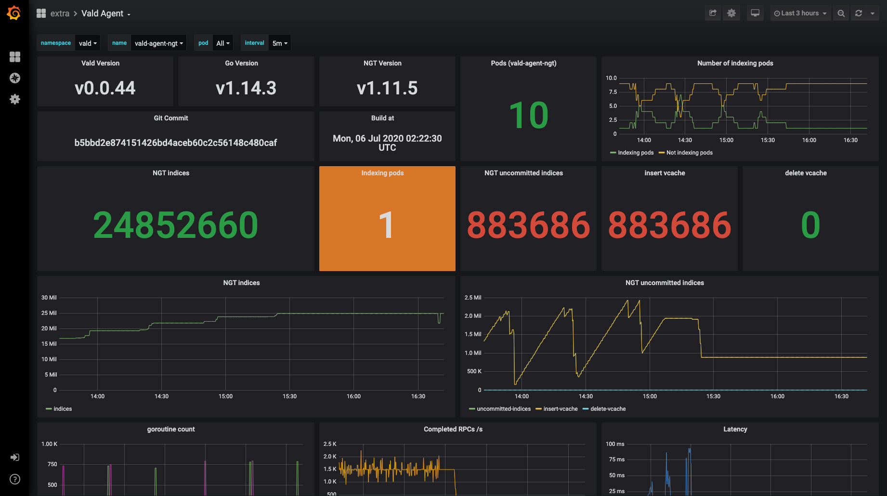

# Operations

This page introduces best practices to operate a Vald cluster.

Table of Contents
---

- [Deployment](#deployment)
    - [Kubernetes cluster](#kubernetes-cluster)
    - [Multi tenant](#multi-tenant)
- [Monitoring](#monitoring)
    - [Logging](#logging)
    - [Observability features of Vald](#observability-features-of-vald)
    - [Enabling observability feature](#enabling-observability-feature)
    - [Monitoring Vald cluster using Prometheus and Grafana](#monitoring-vald-cluster-using-prometheus-and-grafana)
- [Upgrading](#upgrading)
    - [In case of manual deploy](#in-case-of-manual-deploy)
    - [In case of using Helm](#in-case-of-using-helm)
    - [In case of using Vald-Helm-Operator](#in-case-of-using-vald-helm-operator)
- [References](#references)

## Deployment

### Kubernetes cluster

### Multi tenant

## Monitoring

### Logging

The logging level of Vald components can be configured by using `defaults.logging.level` (or `[component].logging.level`) field in Helm Chart values.
The level must be a one of "debug", "info", "warn", "error" and "fatal".
The levels are defined in [the Coding Style document][coding-style-logging].

### Observability features of Vald

The observability features are useful for monitoring Vald components.
Vald has various types of exporters, such as Prometheus, Jaeger or Stackdriver.
Using this feature, you can observe and visualize the internal stats or the events like the number of NGT index, when to create index, or the number of RPCs.

### Enabling observability feature

By setting `defaults.observability.enabled` (or `[component].observability.enabled`) in the Helm Chart values to the value `true`, the observability features become enabled.
If observability features are enabled, the metrics will be collected periodically.
The duration can be set on `observability.collector.duration`.

If you'd like to use tracing feature, you should enable it by setting `observability.trace.enabled` to the value `true`. The sampling rate can be configured with `observability.trace.sampling_rate`

### Monitoring Vald cluster using Prometheus and Grafana

In this section, an example of monitoring Vald cluster using [Prometheus][prometheus-io] and [Grafana][grafana] will be shown.

#### Vald configuration

To use Prometheus exporter, you should enable it by setting both `observability.prometheus.enabled` and `server_config.metrics.prometheus.enabled` to the value `true`.
The exporter port and endpoint are specified in each `server_config.metrics.prometheus.port` and `observability.prometheus.endpoint`.

Now it's ready to scrape Vald metrics.
Please deploy Prometheus and Grafana to your cluster.

#### Deploy Prometheus

Prometheus can be installed using one of the followings.

- [Prometheus Operator][prometheus-operator]
- [Prometheus deployments in Vald repository][vald-prometheus]

It is recommended to use the endpoints role of the service discovery.

#### Deploy Grafana

Grafana can be installed using one of the followings.

- [Grafana Operator][grafana-operator]
- [Grafana deployments in Vald repository][vald-grafana]

#### Example dashboard

Now you can construct your own Grafana dashboard to monitor Vald metrics.
This is an example of a custom dashboard. It is based on [our standard dashboard settings][vald-grafana-dashboards].

## Upgrading

### In case of manual deploy

### In case of using Helm

### In case of using Vald-Helm-Operator

### References

[vald-helm-chart]: https://github.com/vdaas/vald/tree/master/charts/vald
[vald-helm-operator-chart]: https://github.com/vdaas/vald/tree/master/charts/vald-helm-operator

[coding-style-logging]: ../contributing/coding-style.md#logging

[prometheus-io]: https://prometheus.io/
[grafana]: https://grafana.com
[vald-prometheus]: https://github.com/vdaas/vald/tree/master/k8s/metrics/prometheus
[prometheus-operator]: https://github.com/coreos/prometheus-operator
[vald-grafana]: https://github.com/vdaas/vald/tree/master/k8s/metrics/grafana
[vald-grafana-dashboards]: https://github.com/vdaas/vald/tree/master/k8s/metrics/grafana/dashboards
[grafana-operator]: https://operatorhub.io/operator/grafana-operator
